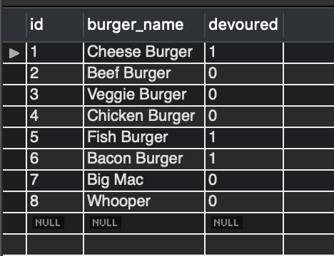
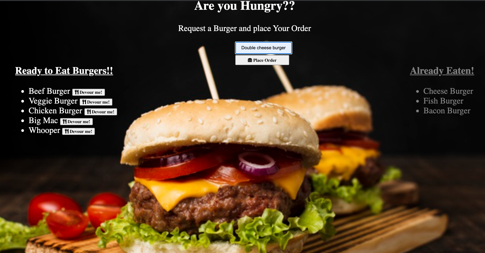

# 🍔 Eat-Da-Burger!!

## Description
This project is a full stack application that allows you to place an order for a burger. When you place an order, the burger you enter in the form field is added to the list of burgers on the left side of the screen. Each burger in the list has a button. Clicking this button moves the burger from the list on the left side of the screen to the list on the right. The list on the right is a list of burgers that have already been devoured.<br>
Key words : Servers,Node, Express.js, MySQL , API routes, Handlebars, Object-relational mapping, Model-View-Controller, Template engines.

## Table of Contents 
* [Functionality](#Functionality)
* [Programming/Scripting_Languages](#Programming/Scripting_Languages)
* [MVC_design_pattern](#MVC_design_pattern)
* [Getting_Started](#Getting_Started)
* [Structure_Of_the_Project](#Structure_Of_the_Project)
* [Screenshots](#Screenshots)
* [Github_Link](#Github_Link)

## Functionality
Using an home-grown ORM, the app has 3 basic CRUD functions...
READ all entries from the MySQL database and display them to the DOM using Handlebars.<br>
UPDATE a selected burger by clicking Button, which... * hits an /burger/eat/:id route in Express to change its "devoured" status in the MySQL database * re-routes the webpage back to the index, where the burger is now in the devoured column (via Handlebars)<br>
CREATE a new burger using the "Place Order" form, which... * hits a /burger/insertOne route in Express to insert a new burger into the MySQL database * re-routes the webpage back to the index, where the burger is now ready to be eaten column (via Handlebars)

## Programming/Scripting_Languages
### Front-end
* HTML,CSS (Bootstrap)
* Javascript (JQuery)

### Back-end
* Node.js,
* npm packages: routing (body-parser, express)
* Templating engine: handlebars
* database: MYSQL
* ORM - Object Relational Mapping

## MVC_design_pattern
This project also follows the MVC (Model-View-Controller) design pattern. The MVC design pattern assigns objects in the application one of three roles (model, view, or controller) and defines the way the different parts of the application communicate with one another.

View object: A view object is an object in the application that is visible (in the user interface) to the end user of the application. The view displays data from the application's model and learns about any changes to the model data via the controller. For example, in this application, the user enters a burger name in a text field. The view communicates the user input via the controller to the model.

Controller object: A controller object controls the flow of data between the view and the model (that is, the controller is an intermediary between the two). The controller interprets any user changes made in the view and communicates the changed data to the model. Also, if the model were to change, the controller is what communicates the updated data to the view so that the user can see the updated data in the user interface.

Model object: A model object manages the data. When data is created or changed by the user in the view (for example, a user devours or throws away a burger), that change is communicated via the controller to the model. Also, when data is created or changed in the model, the model communicates that change via the controller to the view, and the view displays the updated data to the user.


## Getting_Started
The following section will take you through the steps of setting up this application and getting it running locally on your computer.

To set up this application locally on your computer, perform the following steps:

* [Clone_the_repository](#Clone_the_repository)
* [Install_Node.js](#Install_Node.js)
* [Install_the_dependencies](#Install_the_dependencies)
* [Install_MySQL_Workbench](#Install_MySQL_Workbench)
* [Set_up_a_development_database](#Set_up_a_development_database)
* [Create_a_.env_file_to_store_your_MySQL_Password](#Create_a_.env_file_to_store_your_MySQL_Password)
* [Verify_database_connection_information](#Verify_database_connection_information)
* [Start_the_server](#Start_the_server)

1. ### Clone_the_repository
The first step is to clone the project repository to a local directory on your computer. To clone the repository, run the following commands:
```
  git clone https://github.com/guptaria/Eat-Da-Burger.git
  cd Burger
```
## Structure_Of_the_Project
After you clone the repository, navigate to the project root directory (Eat-Da-Burger). The project directory structure is set up as follows:
* server.js: This file does the following:

   * Defines and requires the dependencies, including express, body-parser, and express-handlebars.
   * Sets up the Express server.
   * Sets up the Express server to handle data parsing using body-parser.
   * Points the server to the API routes, which gives the server a map of how to respond when users visit or request  data from various URLs.
   * Defines the port the server is listening on.
   * Starts the server.
   * Allows the app to serve static content from the public directory.


* public: Contains the static content (images, Javascript, and CSS).

   * assets/css/burger_style.css: External CSS stylesheet.
   * assets/img: Contains icons and images used in the application.
   * assets/js/burger.js: Contains the jQuery ajax POST, DELETE, and PUT requests for adding a burger, throwing away a burger, and updating the devoured value for a Eat-Da-Burger, respectively.

* models: Contains a file called burger.js, which contains functions used to manage the application data and interact with the database.
  
   * The burger.js file also includes the code that will call the ORM functions using burger specific input for the ORM.

* db: Contains 2 files:

   * schema.sql: The database schema. The schema is what describes the structure of the database table, and the datatypes that each column of the table can contain. For this project, the database includes one table that includes columns for id, burger name, and devoured state (true or false).
   * seeds.sql: Used to populate the table in the development database with some starter burger data.
* config: Contains 2 files.

   * connection.js: Contains the code to connect Node to MySQL.
   * orm.js: Contains the methods that will execute the necessary MySQL commands in the controllers. These methods are used to retrieve and store data in the database.
* controllers: Contains a file called burgersController.js, which contains different routes (GET, POST, PUT). These routes are used to pass information to and from the view and model objects.

* views: Contains the Handlebars files, which are templates used to generate the html files.

* package.json: Lists the project dependencies (third party npm packages) and their version numbers.
* .gitignore: Anything listed inside this file will not be tracked by GitHub when code is committed.
* package-lock.json: Dependency tree for the project. Lists all the dependencies and their versions.

2. ### Install_Node.js
If you don't already have Node.js installed on your computer, you can install the latest version here: https://nodejs.org/en/.

3. ### Install_the_dependencies
The following npm packages are dependencies to the project.

After you clone the repository to a local directory, change directory to the project root directory and run the following command to install the required npm packages:
```
npm install
```
* express - a Node.js web application framework (https://www.npmjs.com/package/express).
* body-parser - used to parse incoming request bodies in a middleware. (https://www.npmjs.com/package/body-parser)
* dotenv - used to retrieve the MySQL password from a .env file (https://www.npmjs.com/package/dotenv).
* mysql - used to create a connection to the MySQL database via the command line.(https://www.npmjs.com/package/mysql)
* express-handlebars - allows you to use handlebars to create templates to build the HTML.
(https://www.npmjs.com/package/express-handlebars)
Version information for each of these packages is available in the package.json file in the project root directory.

4. ###  Install_MySQL_Workbench
If you don't already have MySQL Workbench installed on your computer, you can install the latest version here: https://www.mysql.com/products/workbench/

For this project, MySQL Workbench is used to visually design, create, and manage the database used to store burger data.

5. ### Set_up_a_development_database
To set up a development database that you can use with this application, perform the following steps:

1. Open the db/schema.sql file and paste the contents of this file into MySQL Workbench.

2. Execute the following statements:
```
  CREATE DATABASE burger_db;
  USE burger_db;
  ```
Running these statements creates a database called burger_db and sets it as the current database being used.

3. Execute the following statement to create a table called burgers.
```
  CREATE TABLE burgers(
   id INT AUTO_INCREMENT,
   burger_name VARCHAR(250) NOT NULL,
   devoured BOOLEAN DEFAULT false,
   PRIMARY KEY(id)
);
  ```
This table includes columns for id (which is the primary key), burger name, and devoured (boolean value).

4. To populate the burgers table with some starting burger data, open up the db/seeds.sql file and paste the contents into MySQL Workbench. Execute the code in seeds.sql from MySQL Workbench:
```
INSERT INTO burgers(burger_name,devoured)
VALUES("Cheese Burger",true),
("Beef Burger",false),("Veggie Burger",true),
("Chicken Burger",false),("Fish Burger",true),
("Bacon Burger",true);
```
Your table should look similar to the following example:


6. ### Create_a_.env_file_to_store_your_MySQL_Password
If you set up MySQL to use a password to connect to your database, you need to provide your own .env file. If you did not set up MySQL with a password, you can skip this step.

Create a file named .env in the project root directory (Eat-Da-Burger) with the following contents. Replace mysql_password with your actual MySQL password.
```
# MySQL Password
MYSQL_PASSWORD='mysql_password'
```
This file will be used by the dotenv npm package, which will pass the password value as an environment variable to the global process.env object in node. Because .env is specified in the .gitignore file, the password is kept private.

7. ### Verify_database_connection_information
Open the config/connection.js file and verify that the database connection information (host, user, port, password, and database) reflects the database you just created.

Modify the connection properties as needed to reflect your database instance.

For example:
```
  var connection = mysql.createConnection({
    host: "localhost",
    port: 3306,
    user: "root",
    password: process.env.MYSQL_PASSWORD,
    database: "burger_db"
  });
  ```
8. ### Start_the_server
After performing all of the setup steps in the Getting started section, navigate to the project root directory (Eat-Da-Burger) and run the following command to start the server:
```
node server.js
```

To verify that the server has started and the application is working locally on your computer, open Chrome and go to http://localhost:8080.


## Screenshots



## Github_Link
[**URL of My Github Repository**](https://github.com/guptaria/Burger)<br>


